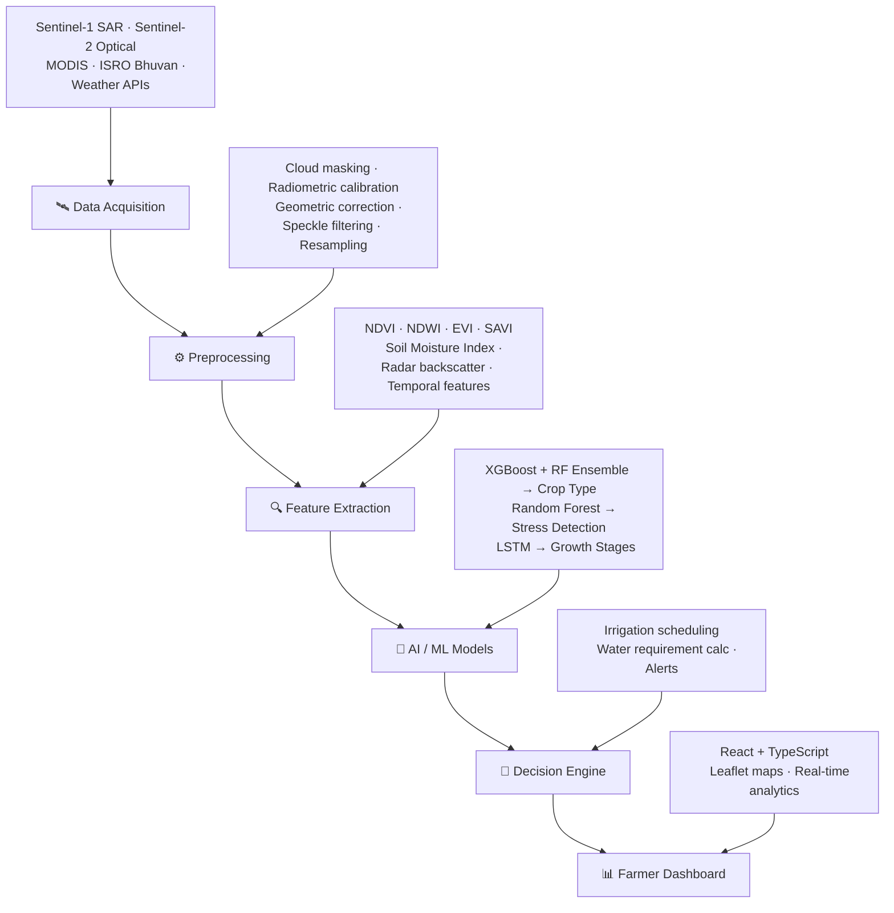

<div align="center">

# 🛰️ CropOrbit AI

### Precision Farming, Powered from Space — Zero Sensors, 100% Sky.

**ISRO Bharatiya Antariksh Hackathon (BAH) 2026 · Team Orbital Queens**

[](https://www.python.org)
[](https://fastapi.tiangolo.com)
[](https://reactjs.org)
[](https://tensorflow.org)
[](LICENSE)

[Overview](#-overview) · [Problem](#-the-problem) · [Solution](#-our-solution) · [Architecture](#-system-architecture) · [Quick Start](#-quick-start) · [API](#-api-reference) · [Team](#-team--orbital-queens)

</div>

---

## 📡 Overview

**CropOrbit AI** turns free satellite imagery into a farmer's most trusted advisor. No IoT sensors, no ground hardware, no guesswork — just an ISRO-grade pipeline that watches every field from orbit and tells farmers exactly what their crop needs, before problems become visible to the naked eye.

| Capability | Detail |
|---|---|
| 🌾 **Crop Type Detection** | Wheat, rice, cotton, sugarcane, maize — **92% accuracy** |
| 💧 **Moisture Stress Classification** | Healthy / Moderate / Severe, flagged early |
| 📈 **Growth Stage Tracking** | Germination → Vegetative → Flowering → Maturity via LSTM |
| 🚿 **Irrigation Advisory** | Exact timing + water volume (mm), not vague suggestions |

> *"Democratizing precision agriculture using satellite intelligence."*

---

## 🚨 The Problem

Indian agriculture loses an estimated **₹45,000+ crore every year** to inefficient irrigation and reactive crop management.

| Challenge | Real-World Impact |
|---|---|
| Over-irrigation | Wastes up to **50%** of water used |
| Late stress detection | Damage occurs before it's visible to farmers |
| Manual field monitoring | Doesn't scale beyond small plots |
| IoT sensor cost | Unaffordable for the average smallholder |
| No data-driven guidance | Irrigation decisions made on instinct, not evidence |

---

## 🚀 Our Solution

CropOrbit AI closes the gap between space-grade Earth observation and the farmer's daily decisions:

| We Deliver | How |
|---|---|
| **Satellite-based monitoring** | Free Sentinel-1/2, MODIS & ISRO Bhuvan data — no hardware install |
| **AI-powered analytics** | Crop classification, stress detection, growth-stage prediction |
| **Actionable advisories** | Tells farmers *when* to irrigate and *how much* water to use |
| **Zero infrastructure cost** | Runs entirely from orbit — nothing to buy, wire, or maintain |
| **Nationwide scalability** | Works for any farm, anywhere in India, from day one |

---

## 🏗 System Architecture



<details>
<summary><b>📋 Text-based pipeline (if Mermaid doesn't render)</b></summary>

1. **Data Acquisition** — Sentinel-1 SAR, Sentinel-2 Optical, MODIS, ISRO Bhuvan, Weather APIs
2. **Preprocessing** — Cloud masking, radiometric calibration, geometric correction, speckle filtering, resampling
3. **Feature Extraction** — NDVI, NDWI, EVI, SAVI, Soil Moisture Index, radar backscatter, polarization ratios, temporal features
4. **AI / ML Models** — XGBoost + Random Forest ensemble (crop type) · Random Forest (stress detection) · LSTM (growth stages)
5. **Decision Engine** — Irrigation scheduling, water requirement calculation, alerts & notifications
6. **User Dashboard** — React + TypeScript, Leaflet maps, real-time analytics, advisory cards

</details>

---

## 🛠 Technology Stack

<table>
<tr><td><b>Frontend</b></td><td>React 18 · TypeScript · TailwindCSS · Leaflet.js · Chart.js</td></tr>
<tr><td><b>Backend</b></td><td>FastAPI (Python) · PostgreSQL · Docker</td></tr>
<tr><td><b>AI / ML</b></td><td>XGBoost · Random Forest · LSTM (TensorFlow) · scikit-learn · pandas · NumPy</td></tr>
<tr><td><b>Satellite Processing</b></td><td>Google Earth Engine · Rasterio · GDAL · SNAP</td></tr>
<tr><td><b>Data Sources</b></td><td>ESA Sentinel-1 & -2 · MODIS · ISRO Bhuvan · IMD Weather API</td></tr>
<tr><td><b>Deployment</b></td><td>AWS / Azure / GCP, containerized with Docker</td></tr>
</table>

---

## 📊 Model Performance

| Model | Accuracy | Precision | Recall | F1-Score |
|---|:---:|:---:|:---:|:---:|
| 🌾 Crop Classification | **92.0%** | 0.91 | 0.90 | 0.90 |
| 💧 Moisture Stress Detection | **88.0%** | 0.87 | 0.86 | 0.86 |
| 📈 Growth Stage Prediction | **85.0%** | 0.84 | 0.83 | 0.83 |

---

## ⚡ Quick Start

### Prerequisites
- Python 3.9+
- Node.js 16+
- PostgreSQL 12+
- Docker *(optional)*

### Clone & Install

```bash
git clone https://github.com/yourusername/croporbit-ai.git
cd croporbit-ai

# Backend setup
cd backend
python -m venv venv
source venv/bin/activate        # Windows: venv\Scripts\activate
pip install -r requirements.txt

# Frontend setup
cd ../frontend
npm install

# Environment variables
cp .env.example .env   # Fill in your API keys (Google Earth Engine, etc.)
```

### Run

```bash
# Backend (FastAPI)
cd backend
uvicorn main:app --reload --host 0.0.0.0 --port 8000

# Frontend (React)
cd frontend
npm start
```

🌐 App: `http://localhost:3000` · 📚 API Docs: `http://localhost:8000/docs`

---

## 🔌 API Reference

| Endpoint | Method | Description |
|---|:---:|---|
| `/api/v1/detect-crop` | `POST` | Detect crop type from satellite data |
| `/api/v1/moisture-stress` | `POST` | Get moisture stress level and percentage |
| `/api/v1/irrigation-advisory` | `POST` | Get irrigation recommendation (timing + water volume) |
| `/api/v1/farm-report/{farm_id}` | `GET` | Complete analytics report for a farm |

<details>
<summary><b>Example: Irrigation Advisory</b></summary>

**Request**
```json
POST /api/v1/irrigation-advisory
{
  "lat": 30.5,
  "lon": 76.3,
  "crop_type": "Wheat"
}
```

**Response**
```json
{
  "recommendation": "Irrigate in 2-3 days",
  "water_needed": 15.0,
  "timing": "Next 48-72 hours",
  "crop": "Wheat",
  "stress_level": "Moderate",
  "confidence": 0.85
}
```

</details>

---

## 📁 Project Structure

```
croporbit-ai/
├── backend/
│   ├── app/
│   │   ├── api/           # FastAPI endpoints
│   │   ├── models/        # ML model wrappers
│   │   ├── services/      # Business logic (satellite fetch, advisory)
│   │   └── utils/         # Helpers (preprocessing, feature extraction)
│   ├── data/               # Sample datasets
│   ├── trained_models/     # Saved models (.pkl, .h5)
│   ├── main.py
│   ├── requirements.txt
│   └── Dockerfile
├── frontend/
│   ├── public/
│   ├── src/
│   │   ├── components/     # Reusable UI components
│   │   ├── pages/          # Dashboard, Map, Analytics
│   │   ├── services/       # API calls
│   │   └── utils/
│   ├── package.json
│   └── Dockerfile
├── docs/                   # Documentation, whitepapers
├── tests/                  # Unit & integration tests
├── docker-compose.yml
├── .env.example
└── README.md
```

---

## 🌍 Impact & Future Scope

### National Impact
- Supports **PMKSY** (Pradhan Mantri Krishi Sinchai Yojana) and the **Digital Agriculture Mission**
- Contributes to **SDG 2** (Zero Hunger) and **SDG 6** (Clean Water)
- Projected to cut water wastage by **25%** and boost yield by **15%**

### Roadmap
- [ ] 📱 Mobile app (Android/iOS) with offline support
- [ ] 🗣️ Voice-based advisories in Hindi, Marathi, Gujarati
- [ ] 🏛️ Government dashboard for regional monitoring
- [ ] 🛡️ Crop insurance integration — risk assessment for insurers
- [ ] ⛅ Weather forecast integration for sharper irrigation timing

---

## 🤝 Contributing

We welcome contributions! See [`CONTRIBUTING.md`](CONTRIBUTING.md) for guidelines.

1. Fork the repo
2. Create your feature branch — `git checkout -b feature/AmazingFeature`
3. Commit your changes — `git commit -m 'Add AmazingFeature'`
4. Push to the branch — `git push origin feature/AmazingFeature`
5. Open a Pull Request

---

## 👩‍🚀 Team — Orbital Queens

| Name | Role |
|---|---|
| **Aditi Rajput** | Team Lead, AI/ML Engineer |
| **Pranjal Gupta** | Satellite Data Processing |
| **Vaidehi Wate** | Full Stack Developer |
| **Hiranya Raut** | Domain Expert (Agriculture) |

---

## 📄 License

Distributed under the MIT License. See [`LICENSE`](LICENSE) for details.

## 🙏 Acknowledgments

- **ISRO** — for organizing BAH 2026 and championing space-based solutions
- **European Space Agency** — for open Sentinel data
- **Google Earth Engine** — for satellite data processing infrastructure
- **Pradhan Mantri Krishi Sinchai Yojana** — for the mission that inspired this build

---

<div align="center">

*"Technology should serve the farmer — not the other way around."*

**CropOrbit AI** — Smarter irrigation. Better harvests. A sustainable future. 🌾

</div>
